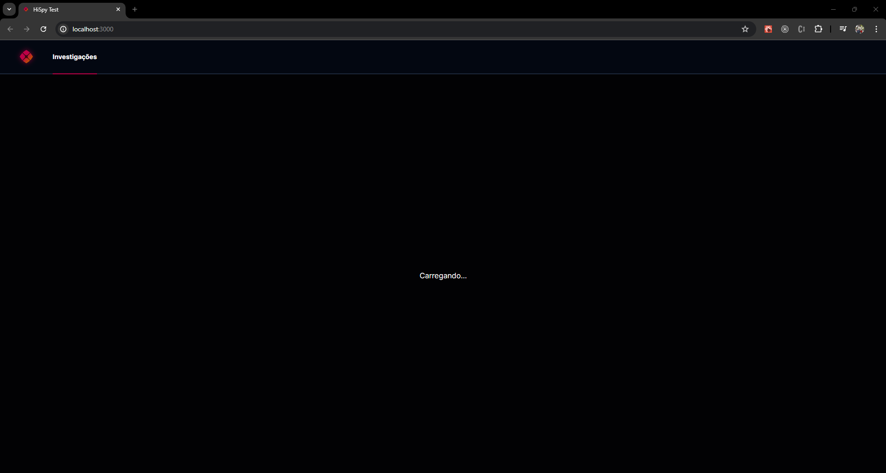
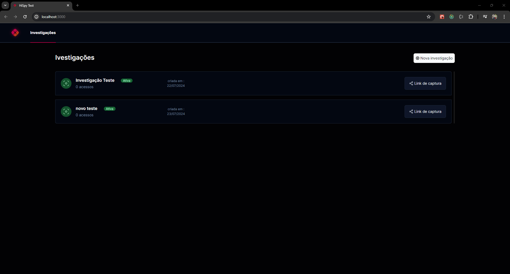
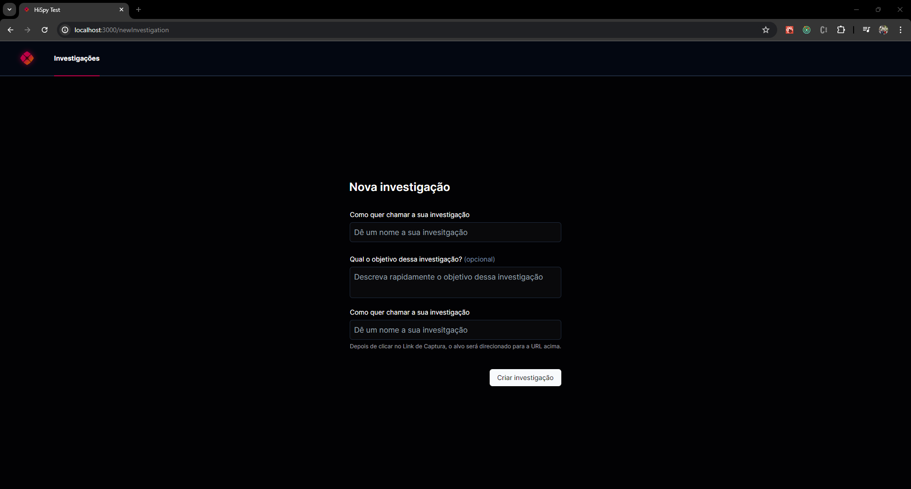
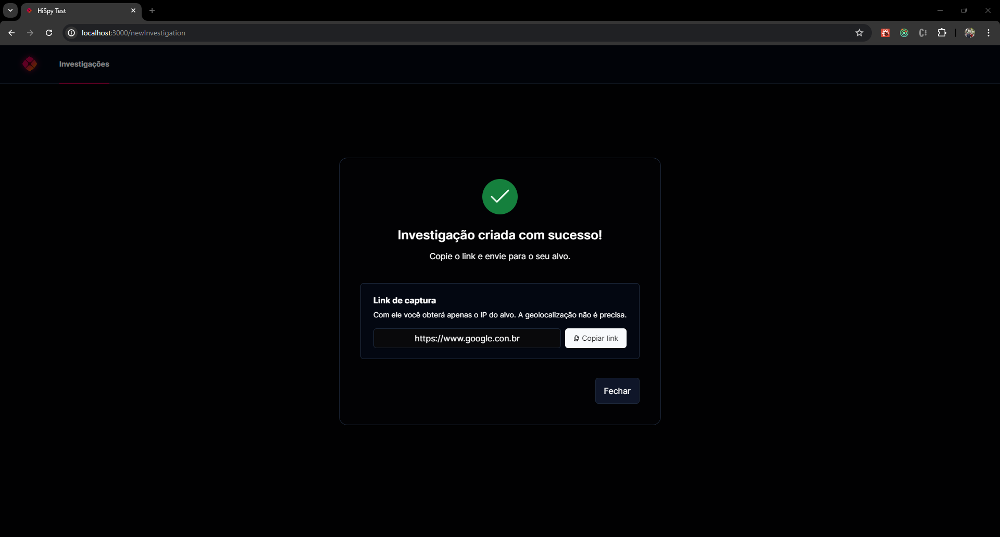
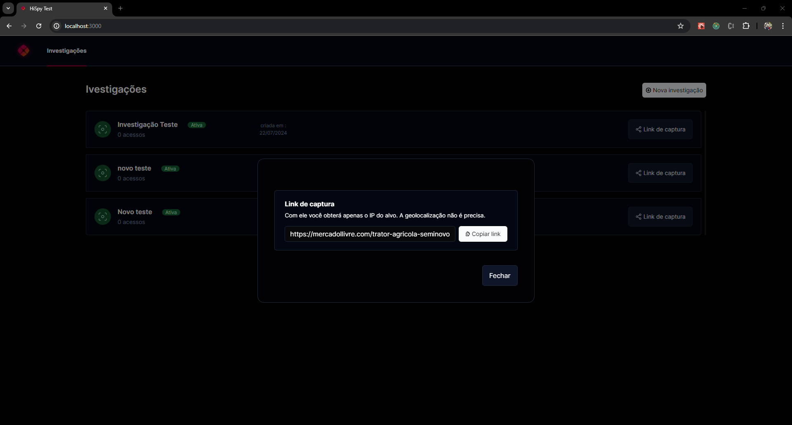

# HI SPY - Investigação de IP


HI SPY é uma aplicação web para criar e gerenciar investigações baseadas em IP. A aplicação utiliza Next.js para o frontend e Supabase para a gestão de dados.

## Índice

- [Funcionalidades](#funcionalidades)
- [Tecnologias Utilizadas](#tecnologias-utilizadas)
- [Instalação](#instalação)
- [Uso](#uso)
- [Estrutura do Projeto](#estrutura-do-projeto)

## Funcionalidades

- Criar novas investigações
- Listar investigações existentes
- Compartilhar links de captura
- Visualizar detalhes da investigação

## Tecnologias Utilizadas

- [Next.js](https://nextjs.org/)
- [Supabase](https://supabase.io/)
- [Tailwind CSS](https://tailwindcss.com/)
- [React](https://reactjs.org/)
- [TypeScript](https://www.typescriptlang.org/)

## Instalação

Para rodar este projeto localmente, siga estas etapas:

1. Clone o repositório:
    ```sh
    git clone https://github.com/guilhermesenci/hispy-test.git
    ```

2. Navegue até o diretório do projeto:
    ```sh
    cd hispy-test
    ```

3. Instale as dependências:
    ```sh
    npm install
    ```

4. Crie um arquivo `.env.local` e adicione suas credenciais do Supabase:
    ```sh
    NEXT_PUBLIC_SUPABASE_URL=your-supabase-url
    NEXT_PUBLIC_SUPABASE_ANON_KEY=your-supabase-anon-key
    ```

5. Inicie o servidor de desenvolvimento:
    ```sh
    npm run dev
    ```

## Uso

### Criar Nova Investigação


1. Clique no botão "Nova Investigação".


2. Preencha os campos necessários no formulário.


3. Clique em "Criar investigação" para salvar a investigação.


4. Cliquem "Copiar link" para enviar o link para a area de transferência.


### Listar Investigações

- Acesse a página principal para ver todas as investigações criadas.

### Compartilhar Link de Captura

- Clique no botão "Link de captura" em uma investigação para copiar o link e compartilhar.

## Estrutura do Projeto

```plaintext
├── public
├── src
│   ├── assets
│   ├── components
│   ├── lib
│   ├── app
│   │   ├── newIvestigation
├── .env.local
├── package.json
├── tailwind.config.jsx
├── ...
└── README.md
